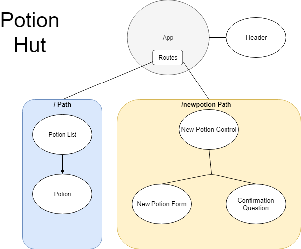

# Potion Brewing Hut

This is a React project that allows the user to create Potions that will be listed for them on the Home page.

## Created By
Derek Hammer
2018

## Installation
1. Clone project into desired location.
2. Direct your terminal to the ReactPotion folder.
3. Enter "npm install" in your teminal.
4. Enter "npm run start".
5. Navigate your browser to the address specified in your terminal.

## Specifications

1. Questions the user on their proficiency before allowing potion brewing.
2. Allows users to create a potion using the form provided.
3. Allows users to view a list of their created potions.

## Future Additions

1. Ability to delete and edit potions.
2. More styling!

## Technologies Used

* JS
* HTML
* React

## Known Bugs

If input is too long, the potion details will overlap the borders of the cards.

| Component Flow Chart|
|-----------|
||

## Support
Report any bugs to Derek Hammer at derek.hammer@gmail.com

### License

This project is distributed under the MIT License